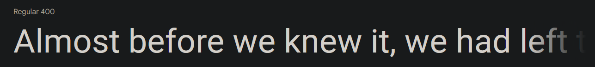
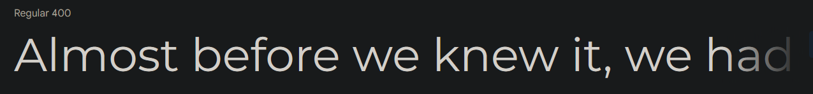

# Mobile Phone Retail Company
## Who are the Stakeholders?
* 30 – 50 year old women
  * Typically this demographic purchases the most phones
* Owners of the Company
  * Cheap and efficient work done
  * Ease of access
* Developers (me)
  * Easy to test
  * Efficiency.

## Specifications:
* Design
* Color
  * 1st Set of Colours:
  
  * 2st Set of Colours:
  
* Layout
* Imagery
* Navigations
* Typography
  * [Roboto Regular 400](https://fonts.google.com/specimen/Roboto#standard-styles)
  
  * [Montserrat Regular 400](https://fonts.google.com/specimen/Roboto#standard-styles)
  

## Interests
* Customers
  * Simple and Easy navigation
  * Product information such as Pricing, Description, Specifications, etc
  * Quick loading
* Owners
  * Cheap
  * Visually good looking
  * Professional
* Developers
  * Well documented
  * Time organisation
  * Maintenence
  * Easy to test?
  * Standards

## Misc Information
* Small company and independant
* In retail

Needs a few designs for alternitives.

## Navigation
Navigation will make the website easier to traverse as the user(s) go to products or other site pages.

H = Entry point
Plan: When a phone page is on, there will be 3 random phones as recommended.

| x | H | SamsungG s21 | Xaomi-Mi 11 | Iphone 13 | PocoX3 | Alcatel3v | Redmi9 | G | H | I | J |
|---|---|---|---|---|---|---|---|---|---|---|---|
| H | 🗸  |   |   |   |   |   |   |   |   |   |   |
| SamsungG s21 | 🗸  |   |   |   |   |   |   |   |   |   |   |
| Xaomi-Mi 11 |  🗸 |   |   |   |   |   |   |   |   |   |   |
| Apple Iphone 13 | 🗸  |   |   |  |   |   |   |   |   |   |   |
| PocoX3 | 🗸  |   |   |   |  |   |   |   |   |   |   |
| Redmi9 | 🗸 |   |   |   |   |  |   |   |   |   |   |
| Iphone13 | 🗸  |   |   |   |   |   |   |   |   |   |   |
| Alcatel3v | 🗸  |   |   |   |   |   |   |   |   |   |   |
| H |   |   |   |   |   |   |   |   |   |   |   |
| I |   |   |   |   |   |   |   |   |   |   |   |
| J |   |   |   |   |   |   |   |   |   |   |   |

## Why I chose Design-1?
It is a professional look with capturing the demographic we want. It looks clean and easy to navigate and the execution of the website was really well done. It was the cleanest of the two and the ease of access to most of the website in one place for all which is better for performance.

# File Structure

#  Reviews
## Ugniusmiel
the basket and the log in icons are not clickable at least make them clickable 

most website have where if you click the logo it would send you back to the name manu so i suggest adding that aswell [Added, great feedback]

alcatel 3v page is missing some text [Missing text was on purpose]

when you click on add to basket it sends you back to the top of the page

## Dodgy Kid ADAM
The colour of the website is very unique however it is a good contrast in colours

instead of using a menu button i would make ur [REDACTED] clickable that takes you back to the main menu

The account and basket button do not work and arent even clickable i would make it so you can even if it doesnt lead anywhere

You dont have the most recent phones here such as the samsung galaxy s22 you should add it king

overall it is a very good website and it looks very pleasing pop off king 

## Levente aka 21 boxes
It is colorful however you should make the login and the basket button interactable, also try to add a few more phones, it would make your website much more colorful.

# What I've done
I have taken the feedback and fixed missing text on the Alcatel 3V page, I was missing some screen specifications.
The account and basket icons are now interactive, they feel more clickable rather than a still image.
I added the Samsung Galaxy S22 as a product.
I have made the Logo clickable and makes you go back to the main page with all the products.
I added a few more phones after Levente's feedback, such as Iphones, Samsungs and Xiaomi's.

# Testing
I was tasked with testing the website and it's product phones to see if they are suitable for various browsers and devices.

## Browser tests
### Firefox

### Chrome

There is a big difference between these two pages, firstly is firefox is larger in height and breaks the product list.
Chrome on the other hand is perfectly fitting and no errors in layout.

# Suitablity
This website is suitable for all audiences, it's nice and colourful to attract the viewers attention and layout is easy to follow and find specific products. It serves the purpose to purchase a brand new phone with ease and variety.

# Timeline
THe main page with products without information to be around the 10th of March, then this gives me until 20th to gather and put in information. I planned 8 phones so I made room for least 8 mobiles. I then planned to make a website template for mobiles, I expected the template process be be done by 8st of April. THe complete process is epected to be done by 1th of May ready for submition.

# Strengths and Weaknesses
The website is far from perfect and so it comes with weaknesses and some strengths. One of the weaknesses is the resolution, It doesn't work well with any other monitor size than 1920x1080p screens. On the other-hand it does have some visibility and readability strengths, in a browser you can enlarge the website and it helps with visibility issues. With considering the feedback I received, I know it the website it requires interactability and device support.